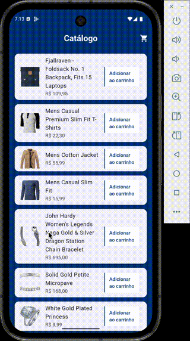

# App Carrinho de Compras

Um app de carrinho de compras feito em Flutter, com arquitetura MVVM, gerenciamento de estado **ChangeNotifier** e padrões como **Command/Result**.
O visual segue um tema **brutalista** (bordas marcantes, azul e vermelho) e o app roda em Android e iOS.


## O que o app faz

### 1. Catálogo de produtos
O usuário vê uma lista de produtos vindos da [Fake Store API](https://fakestoreapi.com/products), com imagem, nome e preço. É possível adicionar itens ao carrinho, aumentar ou diminuir a quantidade e remover. Um ícone no topo mostra quantos produtos diferentes estão no carrinho.

### 2. Carrinho
O carrinho lista os itens com controles de quantidade (+/−) e botão para remover. Há resumo com subtotal, opção de calcular frete por CEP e total final. Ao clicar em **Finalizar**, abre um modal para revisar o pedido antes de concluir.

### 3. Confirmação do pedido
O modal exibe os itens em modo somente leitura, o total e dois botões: **Voltar para o carrinho** ou **Continuar compra**. Ao continuar, o app chama a API de checkout (simulada) e, em caso de sucesso, segue para a animação e a tela de pedido concluído.

### 4. Pedido concluído
Tela final com mensagem de sucesso, resumo (subtotal, frete, total) e botão **Novo pedido** ou voltar, que limpa o carrinho e volta ao catálogo.

---

## Demonstração

Segue um GIF do app mostrando como ficou o código final:



---

## Como rodar

O projeto usa **FVM** (Flutter Version Management) para garantir que todos usem a mesma versão do Flutter.

### 1. Instale o FVM (se ainda não tiver)

```bash
dart pub global activate fvm
```

Certifique-se de que `~/.pub-cache/bin` está no seu `PATH`.

### 2. Instale a versão do Flutter do projeto

```bash
fvm install
```

### 3. Rode o app

```bash
fvm flutter pub get
fvm flutter run
```

**Build:**
```bash
fvm flutter build apk   # Android
fvm flutter build ios   # iOS
```

**Testes:**
```bash
fvm flutter test test/widget_test.dart
fvm flutter test test/presentation/catalog/catalog_screen_test.dart
```

> **Versão do Flutter:** 3.38.9 (definida em `.fvmrc`, requer Dart 3.10+)

---

## Estrutura do projeto

O app segue **MVVM** com camadas bem definidas:

| Camada | O que faz |
|--------|-----------|
| **core/** | Rotas, tema, `Result<T>` para operações assíncronas |
| **shared/** | Helpers (SnackBar, formatação de preço) e widgets reutilizáveis |
| **data/** | APIs (Products, Cart, Checkout), DTOs e persistência (CEP) |
| **domain/** | Modelos (Product, CartItem, Cart) e CartStore (estado global) |
| **presentation/** | Telas e ViewModels (Catalog, Cart, OrderComplete) |

### Fluxo de dados
- **CartStore** é a fonte única de verdade do carrinho e não depende de API.
- **ViewModels** chamam as APIs, tratam `Result` e atualizam o CartStore.
- A **View** usa `Consumer`/`Provider` e reage às mudanças.

### Regras de negócio
- Máximo de 10 produtos diferentes no carrinho.
- Carrinho não pode ser editado após finalização.
- Preços formatados no padrão brasileiro (R$ 1.234,56).

### Tema brutalista
- Bordas grossas (`BorderSide(width: 2.0)`).
- Cores: azul (#093578), vermelho (#900000), ciano (#00A0A3).
